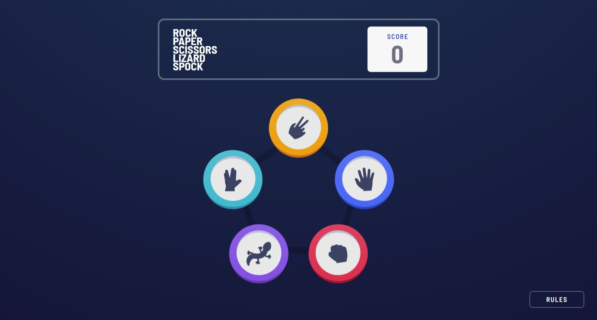
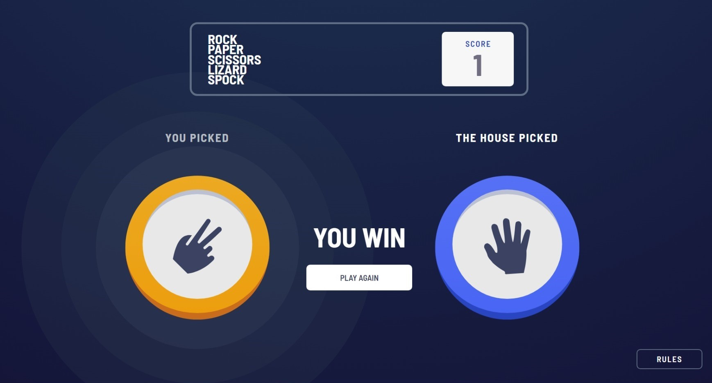
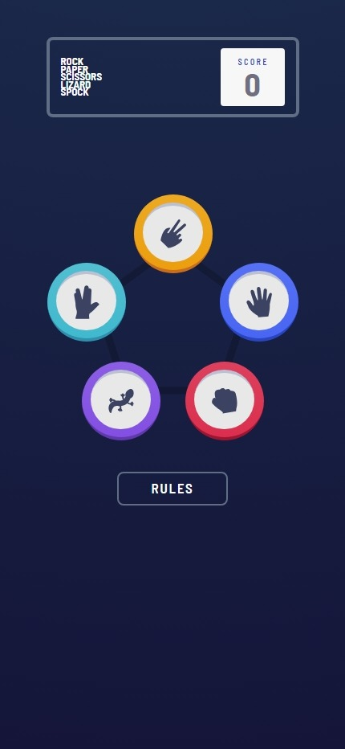
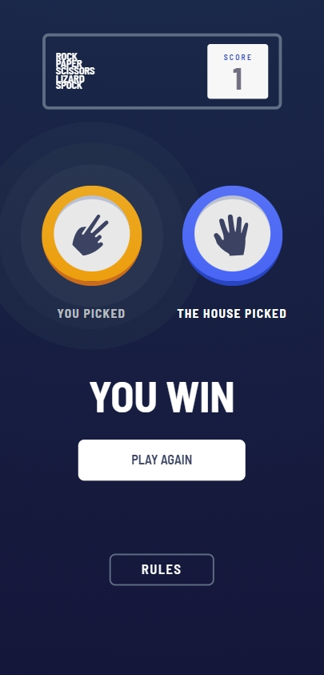

# Frontend Mentor - Rock, Paper, Scissors solution

This is a solution to the [Rock, Paper, Scissors challenge on Frontend Mentor](https://www.frontendmentor.io/challenges/rock-paper-scissors-game-pTgwgvgH). Frontend Mentor challenges help you improve your coding skills by building realistic projects. 

## Table of contents

- [Overview](#overview)
  - [The challenge](#the-challenge)
  - [Screenshot](#screenshot)
  - [Links](#links)
- [My process](#my-process)
  - [Built with](#built-with)
- [Author](#author)

**Note: Delete this note and update the table of contents based on what sections you keep.**

## Overview

### The challenge

Users should be able to:

- View the optimal layout for the game depending on their device's screen size
- Play Rock, Paper, Scissors against the computer
- Maintain the state of the score after refreshing the browser _(optional)_
- **Bonus**: Play Rock, Paper, Scissors, Lizard, Spock against the computer _(optional)_

### Screenshot
 
#### Desktop

- Home

- Result

#### Mobile

- Home

- Result

### Links

- Solution URL: [Github](https://github.com/anindyoo/fe-mentor-6-calculator-app)
- Live Site URL: [Github Pages](https://anindyoo.github.io/fe-mentor-6-calculator-app/)

## My process

### Built with

- Semantic HTML5 markup
- [Tailwind CSS](https://tailwindcss.com/)
- [React](https://reactjs.org/) - JS library
- [GSAP](https://gsap.com/resources/React/) - JS Animation library
- [ESLint](https://eslint.org/) - Linting tool
- [Zustand](https://zustand-demo.pmnd.rs/) - State management tool

## Author

- Frontend Mentor - [@anindyoo](https://www.frontendmentor.io/profile/anindyoo)
- Twitter - [@anindyo_](https://www.twitter.com/anindyo_)
